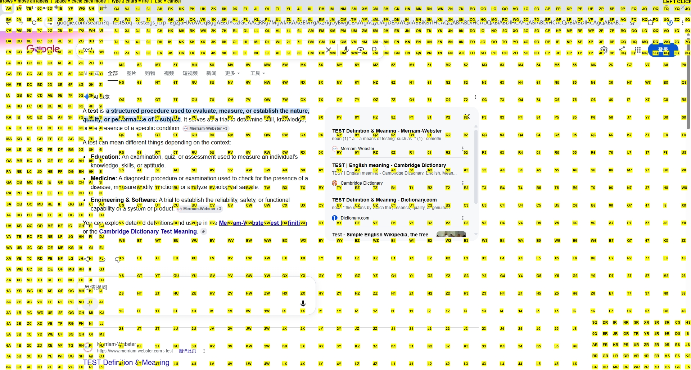

# hunt-and-peck

[](../../actions/workflows/build.yml)
[](LICENSE)

Vimium-style mouseless clicking for Windows. Press a hotkey and a grid of labeled
hints appears over the active window and taskbar; type a label to move or click its
target without touching the mouse. Works on **any** application — including
Chromium/Electron apps (e.g. Feishu) — via a synthetic grid plus real mouse clicks.

Forked from [`zsims/hunt-and-peck`](https://github.com/zsims/hunt-and-peck); this
fork adds grid mode, multi-action click modes, an always-merged taskbar, hot-reload
configuration, and a large performance overhaul.

## Demo

Press the hotkey and a grid of labeled hints appears over the active window **and the
taskbar**; pan with the arrows, cycle the click mode with `Space`, then type a label's
two characters to move or click its target — no mouse needed.




*The overlay is click-through, so your real clicks always reach the app beneath.*

## Download

Grab the latest `HuntAndPeck-*.zip` from the **[Releases](../../releases/latest)** page,
unzip, and run `hap.exe`. Requires the **.NET Framework 4.5.1** runtime (Windows).

## Quick start

1. Launch `hap.exe` (a tray icon appears).
2. Focus any window, press **`Ctrl + Shift + Alt + F`** (the default hotkey; configurable).
3. An overlay of labels appears over the window **and the taskbar**.
4. Use it:
   - **Arrow keys** pan all labels together (3 px; `Shift`+arrows = 15 px) so a label sits on your target.
   - **Space** cycles the click mode (shown by the badge top-right): `Left → Right → Double → Move`.
   - **Type a label's 2 chars** → the cursor jumps to its (panned) position and fires the current mode:
     - `Left` / `Right` / `Double` → a real left / right / double click there.
     - `Move` → cursor positions, **no click** (you click manually).
   - **Esc** cancels.

The overlay is click-through, so your real mouse clicks always reach the app beneath.

## Configuration

All settings live in `hap.exe.config` (next to `hap.exe`). Most are **hot-reload** —
edit, save, and press the hotkey again (no restart). The hotkey itself is read once
at startup, so it needs a **restart** to apply.

| Setting | Default | Purpose |
|--------|---------|---------|
| `HotkeyKey` / `HotkeyModifier` | `F` / `Control,Alt,Shift` | overlay hotkey (**restart** to apply) |
| `HintSource` | `Grid` | `Grid` (instant synthetic grid, any app) or `Automation` (real controls) |
| `ClickModeOrder` | `Left,Right,Double,Move` | Space cycle order (wraps; subset allowed) |
| `HintCharacters` | `ABC…XYZ1234567890` | chars used for labels (letters **and** digits) |
| `HintFontSize` | `10` | label font size (px) |
| `GridEdgeStep` / `GridCenterStep` | `30` / `50` | grid spacing (px) — smaller = denser |
| `GridDenseRegions` | `Left,Top,TR,BR,Center` | which regions get dense clusters |
| `GridInset` / `GridEdgeBandPercent` | `10` / `15` | edge margin (px) / dense-band thickness (%) |
| `NudgeStep` / `NudgeStepFast` | `3` / `15` | arrow pan step / Shift+arrow step (px) |
| `MaxEnumerationDepth` | `0` | `Automation` mode tree depth (0 = unbounded) |
| `TimingLogEnabled` | `false` | set `true` to log overlay timings to `%TEMP%\hap-timing.log` |

### Changing the hotkey
`HotkeyKey` is a [`System.Windows.Forms.Keys`](https://learn.microsoft.com/dotnet/api/system.windows.forms.keys) name (`F`, `Space`, `OemSemicolon`, `D1`, …).
`HotkeyModifier` is a comma-separated list of `Alt` / `Control` / `Shift` / `Windows`.
Example — `Ctrl+Space`:
```xml
<add key="HotkeyKey" value="Space" />
<add key="HotkeyModifier" value="Control" />
```

## How it works

- **Grid mode** (`HintSource=Grid`, default): generates an instant grid of cursor-jump
  points covering the window — no UI Automation tree walk, so it's fast and works on
  any app. The taskbar is always merged in.
- **Automation mode** (`HintSource=Automation`): enumerates the window's real UI
  Automation elements (precise, but slow on huge trees such as Chromium). Supports
  `Invoke`, `Toggle`, `Select`, `ExpandCollapse`, and `Focus` patterns.
- Labels are rendered in a single pass by a custom `DrawingVisual` (`HintCanvas`),
  and config is read once per overlay — so latency stays low even with 1000+ labels.

## Building from source

This is **WPF on .NET Framework 4.5.1** — Windows-only. It cannot be built on
Linux/macOS. Builds run on **GitHub Actions** (`.github/workflows/build.yml`,
`windows-latest`): `nuget restore` → `msbuild` → `vstest` → upload the Release drop.

```bash
msbuild src/HuntAndPeck.sln /p:Configuration=Release /p:Platform="Any CPU"
```
The runnable app is `src/HuntAndPeck/bin/Release/hap.exe` (plus `hap.exe.config` and
its DLLs).

## Credits

Forked from [zsims/hunt-and-peck](https://github.com/zsims/hunt-and-peck). Hint-label
generation is adapted from [Vimium](https://github.com/philc/vimium).
